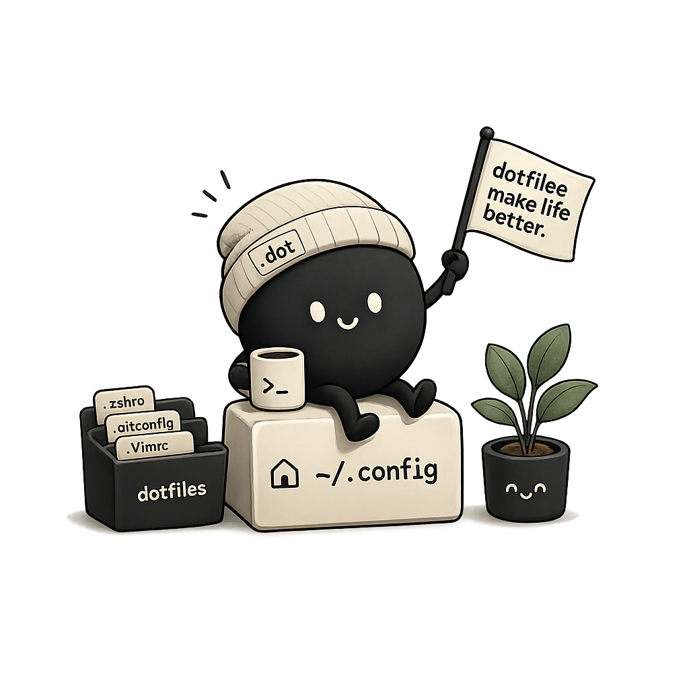
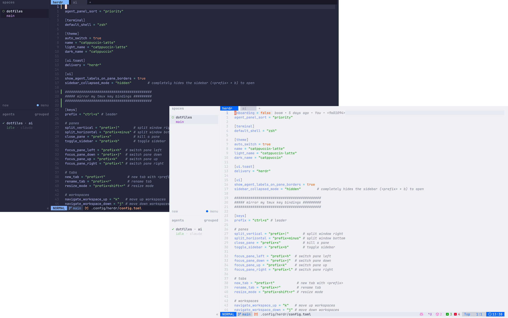

<h1 align="center">
    
    <br/>
    <sub>dotfiles</sub>
</h1>

<p align="center">
    
    
    
    
    
</p>

<p align="center">Personal configuration files — symlinked, versioned, and ready to clone.</p>

---

I live in the terminal. Everything in this repo exists to make that true without friction: one shell config that behaves the same on every machine, one theme that follows macOS between light and dark automatically, and every tool's config tracked in git instead of scattered across `~/.config` and hoped-for memory. It's stowed rather than copied, so editing a config here _is_ editing it live — no sync step, no drift.

## Table of Contents

- [What's in here](#whats-in-here)
- [Directory structure](#directory-structure)
- [Screenshots / demo](#screenshots--demo)
- [Fresh machine setup](#fresh-machine-setup)
- [Stow reference](#stow-reference)
- [Day-to-day workflows](#day-to-day-workflows)
- [Recovering from conflicts](#recovering-from-conflicts)
- [Security](#security)
- [AI](#ai)
- [Quick cheatsheet](#quick-cheatsheet)

---

## What's in here

All configs live under `.config/` and are symlinked into `~/.config` via GNU Stow. The repo root mirrors your home directory — stow creates the links, git tracks the content.

`.local/share/dotfiles/install/` holds machine bootstrap scripts (install flow, Brewfile, and macOS defaults), while `.local/share/dotfiles/default/` contains shared shell modules sourced by both zsh and fish.

### Color Scheme



My setup consists of auto theme switching with catppuccin. Latte for light, and Macchiato for dark. For tmux this is done by setting up [hooks](https://github.com/catppuccin/tmux#for-tmux-versions-prior-to-36) and with LazyVim this is done with the plugin [auto-dark-mode](https://github.com/f-person/auto-dark-mode.nvim)

> **Why bother automating this?** Because I switch environments (bright office, dark room) more often than I remember to run a theme command. If it's not automatic, it doesn't happen.

### Shell

| Config     | What it does                                                                                 | Why I use it                                                                                       |
| ---------- | -------------------------------------------------------------------------------------------- | -------------------------------------------------------------------------------------------------- |
| `zsh`      | Primary shell — functions, completions, abbreviations, and `$PATH` setup all live here       | It's the macOS default and what most completion scripts target — no reason to fight it             |
| `fish`     | Friendly interactive shell config with `conf.d` hooks for atuin and toolchain env setup      | Sane defaults out of the box, no config required — good for pairing sessions on someone else's box |
| `starship` | Cross-shell prompt that shows only what's relevant: git state, language versions, exit codes | One binary and one TOML file renders identically in zsh and fish — I stopped hand-rolling `PROMPT` |
| `atuin`    | Replaces shell history with a searchable, syncable SQLite database                           | Ctrl+R across every terminal I've ever opened, synced across machines — I stopped losing commands  |

### Editor & Terminal

| Config    | What it does                                                                                                                                                         | Why I use it                                                                                                         |
| --------- | -------------------------------------------------------------------------------------------------------------------------------------------------------------------- | -------------------------------------------------------------------------------------------------------------------- |
| `nvim`    | [LazyVim](https://www.lazyvim.org) — a full IDE setup without the config sprawl                                                                                      | LSP, treesitter, and telescope pre-wired means I spend time editing, not configuring                                |
| `ghostty` | GPU-accelerated terminal with a sane default config and zero latency                                                                                                 | Config is a text file, not a preferences GUI — replaced iTerm2's undiffable plist                                    |
| `tmux`    | Session persistence and window management; auto theme switching between Catppuccin Latte/Macchiato on macOS appearance change, with battery status in the status bar | Sessions survive SSH drops and reboots — I want panes exactly where I left them. Currently trialing `herdr` as a possible replacement, nothing migrated yet |
| `sesh`    | Smart tmux session manager with zoxide integration; `dotfiles` session pre-configured to open nvim on attach                                                         | One keystroke into any project's session instead of `tmux ls` and squinting at names                                 |
| `zed`     | Fast native editor for when you want to stay out of the terminal                                                                                                     | The rare moment I want a mouse-driven multi-file diff view without leaving a native app                              |

### TUI Tools

| Config       | What it does                                                                               | Why I use it                                                                                |
| ------------ | ------------------------------------------------------------------------------------------ | ------------------------------------------------------------------------------------------- |
| `lazygit`    | Git operations without memorizing flags — branches, rebases, and diffs in a single view    | I know git's plumbing but I'm not typing `git rebase -i HEAD~6` from memory every time      |
| `hunk`       | Patch review and staging TUI, great for checking diffs                                     | Reviewing hunk-by-hunk in a TUI beats scrolling one giant unified diff                      |
| `herdr`      | Your coding agents from one terminal                                                       | Running several coding agents at once, I needed one window to watch all of them, not N tabs |
| `k9s`        | Kubernetes cluster management from the terminal; essential when `kubectl get` isn't enough | `kubectl get` in a `watch` loop is not a debugging strategy                                 |
| `yazi`       | Terminal file manager with previews, bulk operations, and plugin support                   | Image and archive previews without shelling out to `open` keeps me from breaking flow       |
| `lazydocker` | Container and image management TUI that replaces most `docker` invocations                 | `docker ps` piped through `less` was never a real workflow                                  |
| `television` | Fuzzy finder built for speed — a ripgrep-powered `fzf` alternative                         | Same job as fzf, noticeably snappier on large file trees since it's Rust end to end         |

### System & Productivity

| Config                                         | What it does                                                                                         | Why I use it                                                                                                   |
| ---------------------------------------------- | ---------------------------------------------------------------------------------------------------- | -------------------------------------------------------------------------------------------------------------- |
| `karabiner`                                    | Keyboard remapping at the driver level — complex modifications, home-row mods, layer switching       | Home-row mods and layer switching need to live below the OS keybinding layer — nothing else gets this granular |
| `mise`                                         | Runtime version manager for Node, Python, Ruby, and anything else — replaces `nvm`, `rbenv`, `pyenv` | One tool instead of three                                                                                       |
| `bat`                                          | `cat` with syntax highlighting, line numbers, and git diff markers                                   | Costs nothing and I run `cat` constantly — may as well see syntax and git gutters                              |
| `btop`                                         | System monitor with a layout that actually uses your terminal width                                  | The only monitor I've used that doesn't waste half the terminal on padding                                     |
| `gh`                                           | Official GitHub CLI — PRs, issues, workflows, and releases from the terminal                         | PRs and issues without opening a browser tab I'll forget to close                                              |
| `gh-dash`                                      | Dashboard TUI for `gh` — all your open PRs and issues in one view                                    | Better triage than GitHub's notification page, refreshed on keypress                                           |
| `sqruff`                                       | SQL linter and formatter config                                                                      | Consistent SQL formatting so PR review isn't an opinion war over comma placement                               |
| [`bucky`](https://github.com/mrpbennett/bucky) | A personal S3/FTP TUI for managing object storage                                                    | Wrote it myself — nothing else gave me a fast TUI for poking at buckets                                        |

---

## Directory structure

```text
.
├── .claude/
│   └── CLAUDE.md              # instructions for Claude Code when it works in this repo — see AI
├── .config/                   # stowed straight into ~/.config, one directory per tool
│   ├── nvim/                  # LazyVim
│   ├── tmux/                  # currently trialing herdr as a possible replacement
│   ├── ghostty/
│   ├── zellij/                # parked from an earlier evaluation — tmux won that round
│   └── ...                    # one directory per tool in the tables above
├── .local/share/dotfiles/
│   ├── default/shell/         # modules sourced by both zsh and fish
│   │   ├── aliases
│   │   ├── envs.sh
│   │   ├── fns
│   │   ├── init.sh            # `eval $(... init)` hooks: atuin, television, starship, zoxide, mise
│   │   ├── rc.sh
│   │   └── rc.fish
│   └── install/
│       ├── install.sh         # the one script that bootstraps a fresh machine
│       ├── brew/Brewfile      # every formula and cask this setup depends on
│       └── macos/defaults.sh  # `defaults write` tweaks — trackpad speed, key repeat, etc.
├── assets/                    # README images — excluded from stow, see .stow-local-ignore
├── .zshrc
├── .ideavimrc
├── .hushlogin
└── README.md
```

## Fresh machine setup

**Assumes:** macOS 26 (Tahoe) or later, Apple Silicon. Nothing here is version-pinned to a specific macOS release — the `defaults write` keys in `macos/defaults.sh` have been stable since Big Sur — but this is what I've actually tested against.

### 0. Command Line Tools

```sh
# Installs git, among other things stow/homebrew need later
xcode-select --install
```

### 1. Clone the repo

```sh
git clone <repo-url> ~/Developer/personal/dotfiles
```

### 2. Run the installer

```sh
~/Developer/personal/dotfiles/.local/share/dotfiles/install/install.sh
```

`install.sh` does exactly this, in order:

1. **Installs Homebrew** if `brew` isn't already on `$PATH` (same one-liner as [brew.sh](https://brew.sh): `/bin/bash -c "$(curl -fsSL https://raw.githubusercontent.com/Homebrew/install/HEAD/install.sh)"`).
2. **Runs `brew bundle`** against `brew/Brewfile` — CLI tools, shells, dev tools, and a handful of casks (Ghostty, JetBrains Mono Nerd Font, mitmproxy, ngrok).
3. **Stows the repo** _before_ installing oh-my-zsh, deliberately — see the note below.
4. **Installs oh-my-zsh** plus the `zsh-autosuggestions` and `zsh-syntax-highlighting` plugins.
5. **Runs `mise install`** to pull every pinned language runtime.
6. **Clones `tpm`** (tmux plugin manager) so `prefix + I` inside tmux can install the rest.
7. **Applies macOS defaults** from `macos/defaults.sh` — trackpad tracking speed, disabling press-and-hold accent popups (it fights vim's key repeat), and a few Finder/Dock tweaks. Requires a logout or reboot to fully apply.

> **Why stow before oh-my-zsh?** A fresh machine has no `~/.zshrc`. If oh-my-zsh installs first, it writes its own template there, and stow later refuses to symlink over a real file. Stowing first means oh-my-zsh finds our `.zshrc` already in place and leaves it alone.

> **Verify it worked:** `readlink ~/.config/tmux` should print `../Developer/personal/dotfiles/.config/tmux`

---

## Stow reference

<details>
<summary>How stow's symlinking actually works, plus the full command reference</summary>

### The mental model

This repo's root is laid out to **mirror your home directory** — `.config/tmux` in the repo corresponds to `~/.config/tmux`, `.zshrc` in the repo corresponds to `~/.zshrc`. Stow's only job is walking that tree and creating a symlink at each real-world path pointing back into the repo. Nothing is copied; editing `~/.config/tmux/tmux.conf` _is_ editing the file in git, because it's the same inode reached through a different path.

That's also why conflicts happen: if a real file already sits where a symlink needs to go, stow won't silently replace it — it errors and asks you to move it out of the way first.

### Dry run — preview without touching anything

```sh
# Always run this first on an unfamiliar machine
stow -nv --target="$HOME" .
```

Prints every link that _would_ be created or removed. Nothing is changed.

### Stow — create symlinks

```sh
stow --target="$HOME" .
```

Idempotent. Already-correct symlinks are left alone — safe to re-run anytime.

### Restow — sync after changes

```sh
# Run after adding a new tool config, renaming a directory, or pulling someone else's changes
stow --restow --target="$HOME" .
```

Unstow + stow in a single step.

### Unstow — remove all symlinks

```sh
stow --delete --target="$HOME" .
```

Removes every symlink stow created. Your `.bak` directories (if you made any) are untouched — rename them back to restore the originals.

### Verbose output

```sh
stow --verbose --target="$HOME" .
# combine with dry run:
stow -nv --target="$HOME" .
```

</details>

---

## Day-to-day workflows

### Adding a new app's config

Move the existing config into the repo, then restow:

```sh
mv ~/.config/newapp ~/Developer/personal/dotfiles/.config/newapp
cd ~/Developer/personal/dotfiles
stow --restow --target="$HOME" .
```

Then commit the new directory. The symlink is live immediately — no restart needed.

### Removing an app from stow

```sh
# Remove from repo
rm -rf ~/Developer/personal/dotfiles/.config/oldapp

# Clean up the now-dead symlink
stow --restow --target="$HOME" .
```

The app will recreate `~/.config/oldapp` fresh on next launch using its own defaults.

---

## Recovering from conflicts

If stow exits with a `conflicts` error, a real file (not a symlink) exists at the target path. Two options:

```sh
# Option 1: back it up and re-run
mv ~/.config/problem-app ~/.config/problem-app.bak
stow --target="$HOME" .
```

```sh
# Option 2: adopt it — stow moves the file INTO the repo and links back
# Use this only if you want to pull the existing file into your dotfiles
stow --adopt --target="$HOME" .
git diff  # always review before committing — adopt can be destructive
```

> **Note on `--adopt`:** This flag rewrites the file _in your repo_ to match what's on disk. If the on-disk version is worse than what you had committed, you'll overwrite your config. Check `git diff` before you `git add` anything.

---

## Security

**Never commit credentials to this repo.**

API keys, tokens, session cookies, and passwords do not belong here. The right pattern is a machine-local file that's sourced but never tracked:

```sh
# ~/.config/fish/local.fish — gitignored, sourced from conf.d, never leaves this machine
set -gx GITHUB_TOKEN "ghp_..."
set -gx OPENAI_API_KEY "sk-..."
```

```sh
# equivalent for zsh — ~/.env.local, sourced from the end of .zshrc
export GITHUB_TOKEN="ghp_..."
export OPENAI_API_KEY="sk-..."
```

Both live outside the repo entirely (or inside it but git-ignored) — either way, `git status` should never be able to see them. A few rules that follow from that:

- Machine-specific secrets live in a file sourced _outside_ this repo's tracked files (e.g. `~/.config/fish/local.fish`, added to `.gitignore` — not `.stow-local-ignore`, which only controls what stow skips, not what git tracks)
- Long-term secrets belong in a password manager or secrets manager, not in any dotfile
- If you accidentally commit a secret, treat it as compromised immediately — git history is public

> **Before every commit:** run `git diff --staged` and actually read it. A one-line "just adding a new alias" commit is exactly the kind of diff where a pasted token hides in plain sight.

---

## AI

A [`.claude/CLAUDE.md`](.claude/CLAUDE.md) file lives in this repo and instructs [Claude Code](https://claude.ai/code) how to behave when it works here. It's not boilerplate — it encodes the same caution I'd want from a human collaborator touching my personal environment:

- **Read-only GitHub access** — no PRs, commits, or pushes on my behalf. This repo is mine to review before anything leaves my machine.
- **Extend, don't replace** — when editing an existing config or keybinding, preserve what's already there instead of regenerating it from scratch. My tmux/nvim keymaps have years of muscle memory baked in; a clean-slate rewrite breaks that even when the result is "better."
- **Plan before touching config** — non-trivial changes get a written plan first, since a bad symlink or a botched `stow --adopt` can quietly eat a config I care about.
- **Verify before claiming done** — actually check the change worked (`readlink`, a dry-run stow, a re-sourced shell) rather than assuming a diff that looks right behaves right.

Most dotfiles repos don't bother with this because most dotfiles repos aren't edited by an agent. Mine is, often, so the instructions are load-bearing rather than decorative.

---

## Quick cheatsheet

<details>
<summary>Every stow command you'll actually need, in one block</summary>

```sh
# Preview what stow will do (always run first)
stow -nv --target="$HOME" .

# Create / update symlinks
stow --target="$HOME" .

# Sync after adding or moving configs
stow --restow --target="$HOME" .

# Remove all symlinks
stow --delete --target="$HOME" .

# Verify a specific symlink
readlink ~/.config/fish
```

</details>
